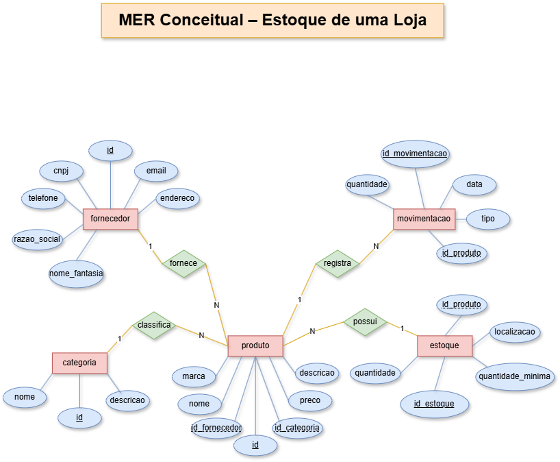
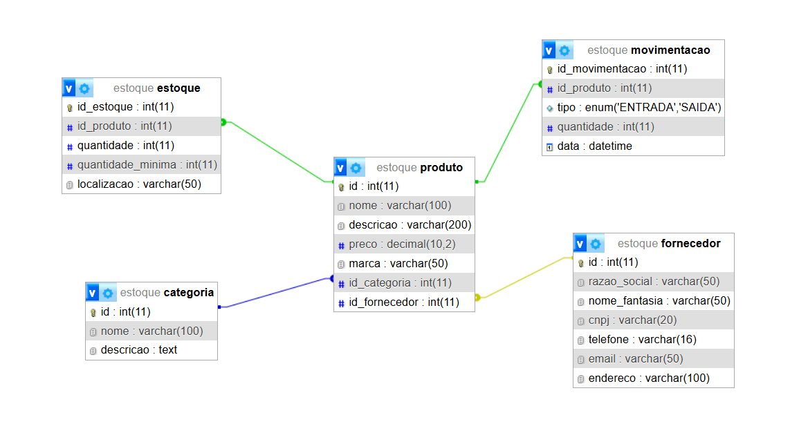

# SESI BCD VPS01 — Estoque de uma Loja

## MER Conceitual



## DER Conceitual



---

# Dicionário de Dados

| **Entidade** | **Atributo** | **Tipo** | **Tamanho** | **Descrição** |
|---|---|---|---|---|
| Categoria | id | Inteiro | 11 | Identificador da categoria, PK, auto incrementável |
| Categoria | nome | Texto | 100 | Nome da categoria |
| Categoria | descricao | Texto | — | Descrição da categoria |
| Fornecedor | id | Inteiro | 11 | Identificador do fornecedor, PK, auto incrementável |
| Fornecedor | razao_social | Texto | 50 | Razão social do fornecedor |
| Fornecedor | nome_fantasia | Texto | 50 | Nome fantasia do fornecedor |
| Fornecedor | cnpj | Texto | 20 | CNPJ do fornecedor |
| Fornecedor | telefone | Texto | 16 | Telefone do fornecedor |
| Fornecedor | email | Texto | 50 | E-mail do fornecedor |
| Fornecedor | endereco | Texto | 100 | Endereço do fornecedor |
| Produto | id | Inteiro | 11 | Identificador do produto, PK, auto incrementável |
| Produto | nome | Texto | 100 | Nome do produto |
| Produto | descricao | Texto | 200 | Descrição do produto |
| Produto | preco | Decimal | 10,2 | Preço do produto |
| Produto | marca | Texto | 50 | Marca do produto |
| Produto | id_categoria | Inteiro | 11 | Identificador da categoria, FK referenciando Categoria (id) |
| Produto | id_fornecedor | Inteiro | 11 | Identificador do fornecedor, FK referenciando Fornecedor (id) |
| Estoque | id_estoque | Inteiro | 11 | Identificador do estoque, PK, auto incrementável |
| Estoque | id_produto | Inteiro | 11 | Identificador do produto, FK referenciando Produto (id) |
| Estoque | quantidade | Inteiro | 11 | Quantidade disponível em estoque |
| Estoque | quantidade_minima | Inteiro | 11 | Quantidade mínima para controle do estoque |
| Estoque | localizacao | Texto | 50 | Localização do produto no estoque |
| Movimentação | id_movimentacao | Inteiro | 11 | Identificador da movimentação, PK, auto incrementável |
| Movimentação | id_produto | Inteiro | 11 | Identificador do produto, FK referenciando Produto (id) |
| Movimentação | tipo | ENUM | ENTRADA/SAIDA | Tipo da movimentação |
| Movimentação | quantidade | Inteiro | 11 | Quantidade de produtos movimentados |
| Movimentação | data | Data/Hora | — | Data e hora da movimentação |

---

# Dados de teste em csv

- [📄 categoria.csv](categoria.csv)
- [📄 fornecedor.csv](fornecedor.csv)
- [📄 produto.csv](produto.csv)
- [📄 estoque.csv](estoque.csv)
- [📄 movimentacao.csv](movimentacao.csv)

---

# Script SQL DDL

```sql
drop database if exists estoque;

create database estoque;

use estoque;

create table categoria(
    id int primary key auto_increment not null,
    nome varchar(100) not null,
    descricao text
);

create table fornecedor(
    id int primary key auto_increment not null,
    razao_social varchar(50) not null,
    nome_fantasia varchar(50) not null,
    cnpj varchar(20) not null,
    telefone varchar(16) not null,
    email varchar(50) not null,
    endereco varchar(100) not null
);

create table produto(
    id int primary key auto_increment not null,
    nome varchar(100) not null,
    descricao varchar(200),
    preco decimal(10,2) not null,
    marca varchar(50) not null,
    id_categoria int not null,
    id_fornecedor int not null
);

create table estoque(
    id_estoque int primary key auto_increment not null,
    id_produto int not null,
    quantidade int not null,
    quantidade_minima int not null,
    localizacao varchar(50) not null
);

create table movimentacao(
    id_movimentacao int primary key auto_increment not null,
    id_produto int not null,
    tipo enum('ENTRADA', 'SAIDA') not null,
    quantidade int not null,
    data datetime not null default(curtime())
);

alter table produto add constraint fk_categoria foreign key (id_categoria) references categoria(id);

alter table produto add constraint fk_fornecedor foreign key (id_fornecedor) references fornecedor(id);

alter table estoque add constraint fk_estoque_produto foreign key (id_produto) references produto(id);

alter table movimentacao add constraint fk_movimentacao_produto foreign key (id_produto) references produto(id);
```

---

# Script SQL DML

```sql
use estoque;

insert into categoria(nome, descricao) values
("Upper body", "Components of the upper part of an armour"),
("Central piece", "Components of the central part of an armour"),
("Lower body", "Components of the lower part of an armour");

insert into fornecedor(razao_social, nome_fantasia, cnpj, telefone, email, endereco) values
("Giovanni's.ltd", "Giovanni's smithy", "53.673,123/0001-10", "(39)12942-1583", "giovannismithy@email.com", "Passo dello Stelvio - 1"),
("Mario's.ltd", "Mario's little forge", "34.145.102/0001-99", "(39)81924-1567", "mariolittleforge@email.com", "Grande Strada delle Dolomiti - 67"),
("Luigi's.ltd", "Luigi's shop", "42.783.567/0001-45", "(39)44128-1532", "luigishop@email.com", "Strada della Forra - 30");

insert into produto(nome, descricao, preco, marca, id_categoria, id_fornecedor) values
("Sallet", "Italian 15th-century helmet", 2000, "Giovanni's smithy", 1, 1),
("Cuirass", "Italian 15th-century main chest armour", 4000, "Mario's little forge", 1, 2),
("Sabaton", "Italian 15th-century armoured boots", 1200, "Luigi's shop", 3, 3);

insert into estoque(id_estoque, id_produto, quantidade, quantidade_minima, localizacao) values
(1, 1, 15, 1, "Lombardia"),
(2, 2, 7, 1, "Veneto"),
(3, 3, 20, 1, "Lombardia");

insert into movimentacao(id_movimentacao, id_produto, tipo, quantidade) values
(1, 1, "ENTRADA", 4),
(2, 2, "SAIDA", 3),
(3, 3, "SAIDA", 6);

```
